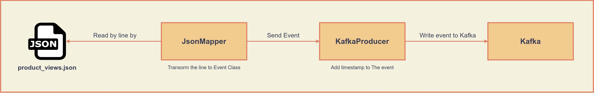

## spring-kafka-etl-api

This project occurs four application. This project read ndjson file that named `product-views.json` by line by and write the line to Kafka. And then, reads the line, that written to Kafka, from Kafka then write to PostgreSQL.

Plus, implements ETL process to `products`, `orders`, `order_items` tables that take place in PostgreSQL.

Also, with API return ten viewed products given userId and recommend products given userId.

## Diagrams

### View-Producer Diagram

Diagram

### Stream-Reader Diagram

Diagram

### ETL-process Diagram

Diagram

### API Diagram

Diagram

## Modules and Modules' description

Module | Use Technology | Description
------ | -------------- | -----------
[view-producer](view-producer) | Java Spring | Reads product-views.json file by line by and transform the line to Event class and writes to Kafka.
[stream-reader](stream-reader) | Java Spring | Reads Event from Kafka and transform the event to BrowsingHistory class and the class write to PostgreSQL Database.
[etl-process](etl-process) | PySpark | Implements ETL to orders, products and order_items tables. These tables joins bestseller_product table.
[api](api) | Java Spring | Returns response for specific requests.

> Click the module name to read its own README

## Requirements Check

Module | Code | README | Unittest | Containerization
------ | ---- | ------ | -------- | ----------------
viewed-producer | :heavy_check_mark: | :heavy_check_mark: | :x: | :heavy_check_mark:
stream-reader | :heavy_check_mark: | :heavy_check_mark: | :x: | :heavy_check_mark:
etl_process | :heavy_check_mark: | :heavy_check_mark: | :heavy_check_mark: | :heavy_check_mark:
api | :heavy_check_mark: | :heavy_check_mark: | :heavy_check_mark: | :heavy_check_mark:

## Install

If you don't want to install anything so run below command:
    
    docker-compose -f project-docker-compose.yml up -d

If you want to install applications single by single except above installing. For this, click to module name you want to install.