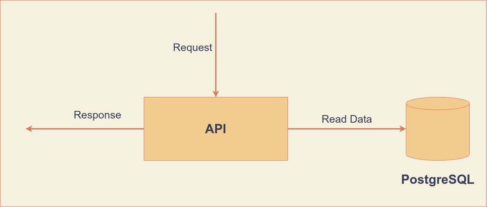

## API

API, return data below request:

* Browsing History
  * Last ten products viewed by a given user. GET endpoint, inputs: user-id
  * Delete a product from given user. DELETE endpoint, inputs: user-id, product-id
* Best Seller Products: GET endpoint, inputs: user-id
  * If given user has history, using the user history for extract most three category. Then use these categories to recommendation ten products bought (last month) by the most distinct users.
  * If given user has not history, recommend ten products bought (last month) by the most distinct users.

## Diagram



### Browsing History

#### GET Request Query

```roomsql
SELECT product_id FROM browsing_history
WHERE user_id = :userId
ORDER BY timestamp DESC
```

#### DELETE Request Query

```roomsql
DELETE FROM browsing_history
WHERE user_id = :userId AND product_id = :productId
```

### Bestseller Product

#### If user has history

```roomsql
SELECT foo.product_id FROM (
    SELECT user_id, product_id FROM bestseller_product
    WHERE category_id IN (
        SELECT category_id FROM browsing_history
        WHERE user_id = 103
        GROUP BY category_id, product_id
        ORDER BY count(product_id) DESC
        LIMIT 3
    )
    GROUP BY user_id, product_id
    ) AS foo
GROUP BY product_id, user_id
ORDER BY count(*) DESC
LIMIT 10
```

#### If user has not history

```roomsql
SELECT foo.product_id FROM (
    SELECT user_id, product_id FROM bestseller_product
    GROUP BY user_id, product_id
    ) AS foo
GROUP BY product_id, user_id
ORDER BY count(*) DESC
LIMIT 10
```

## Dependencies
    
    Java-11
    Maven
    PostgreSQL

## Install

    mnv install

## Run
    
    mvn spring-boot:run
