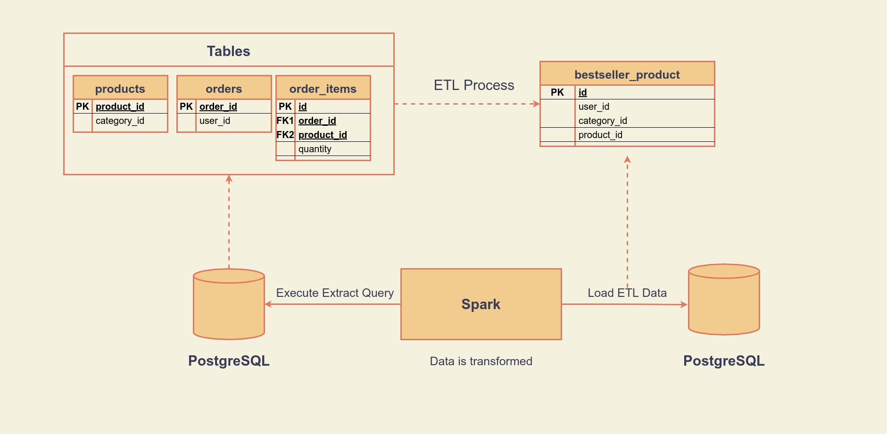

## ETL-Process

export PYTHONPATH=$(pwd)

ETL-Process, implements ETL to `orders`, `products` and `order_items` tables. These tables joins `bestseller_product` table.

Code | README | Unittest | Containerization
---- | ------ | -------- | ----------------
:heavy_check_mark: | :heavy_check_mark: | :heavy_check_mark: | :heavy_check_mark:

## Dependencies

    Python3
    Spark

## Install

### Local

    pip3 install -r requirements.txt

### Docker
For execute the project, in root directory run belowe command:

    docker build . --tag case/etl_process

## Run

### Local

For execute the project, in root directory run belowe command:

    spark-submit --driver-class-path src/jars/postgresql-42.2.5.jar main.py

### Docker

    docker run --network='host' case/etl_process

## Diagram

